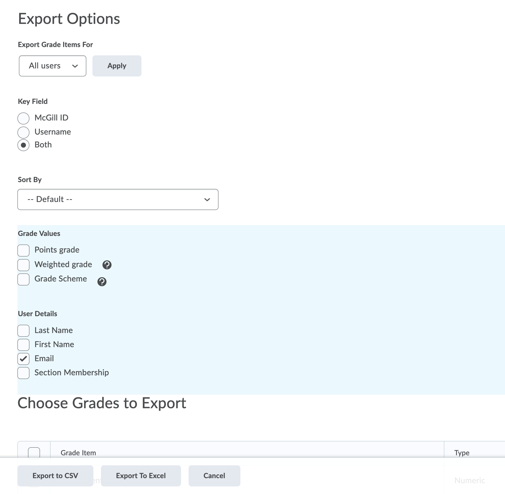
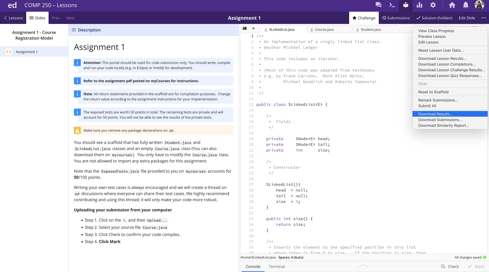
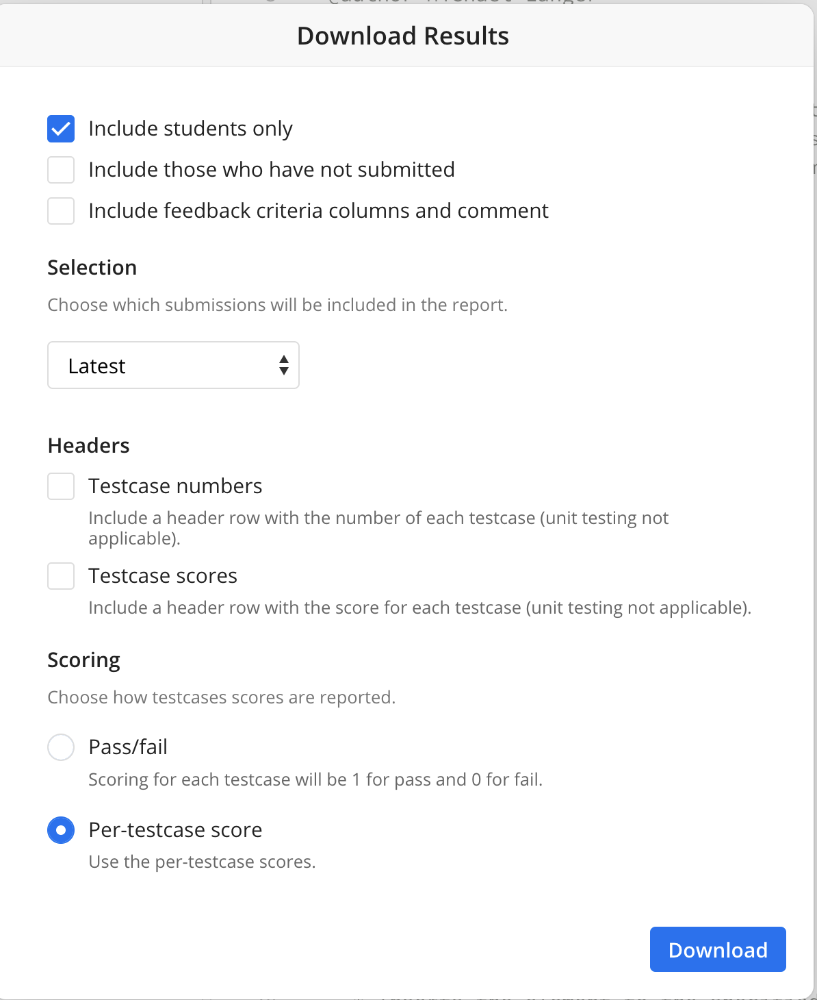

# Grades Preperation

This is a quick rundown of what I normally do to upload grades from `ed` to `mycourses`. Replace `X` everywhere with the number of the current assignment (1,2,3 etc.).

### Step 0
First I download the classlist from mycourses. You need to do this just once for each semester. To do this go to 
`Grades` -> `Export` and select the following configuration. 

Hit `Export to CSV` and download the file. This will be the `classlist.csv` for the semester.

### Step 1
After an assingment has passed the deadline and submissions are closed, incase there were updates to any private tests during the courses of the assignment, click on `Remark Submissions` from the dropdown first and remark their latest submission. 

Then, select `Download Results` from the drop down. 

Select the following configuration and download the csv file of all the grades of the latest submission of each student. This will be `aX_latest.csv`. 


### Step 2
Open `prep.py`, adjust the deadline according to the current assignment. Change the name as well in - 

```
final=final.rename(columns = {
    'total':'Assignment X Points Grade <Numeric MaxPoints:100 Weight:10>',
    'penalty':'AX late penalty Points Grade <Numeric MaxPoints:20 Weight:0>'
})
final.to_csv('aX_grades.csv',index=False)
```

where `X` would be the number of the current assignment.

### Step 3
Run the file and it should prepare a file `aX_grades.csv` which you can finally upload to mycourses. To upload go to `Grades` -> `Import` and select the csv prepared and upload.

### Details about `prep.py`

- The reason we download the email and username in `Step 0` is because almost all the time there are discrepencies with the email/username on `mycourses` and the email on `ed`. Sometimes `ed` has the username of the student, sometimes it has the email of the student. I think it arises form students having both `@mcgill.ca` IDs and `@mail.mcgill.ca` IDs. That's why we download both and if you take a look at the code in `prep.py`, this section of the code is trying to match one of those :

```

with open('classlist.csv', mode='r') as inp:
    reader = csv.reader(inp)
    email_id_dict = {rows[2]:rows[0] for rows in reader}

with open('classlist.csv', mode='r') as inp:
    reader = csv.reader(inp)
    username_dict = {rows[1][1:]:rows[0] for rows in reader}

```
- `results.drop(results.columns[[1,3,4,5,6,7,8,9,]], axis=1, inplace=True)`
This line in the code is just removing all the columns we do not need. if `ed` changes their csv format in the future you might have to change these indices. We only need the following columns :
    - Email
    - Submitted
    - All the scores for each test